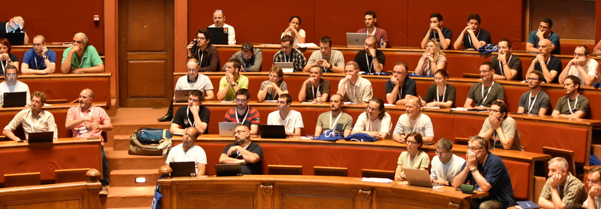

<!--
<b>L'Appel à Orateurs est clos</b>
-->

<!--
<h3><b>Prolongation Date limite des propositions.</b></h3>

La date limite de réception des propositions a été repoussée au 2 mars 2018 à 23h59 CEST

-->

<!--

## Appel à Oratrices et Orateurs
-->

 Le PG Day France est la conférence annuelle de la communauté francophone de PostgreSQL.

Cette année, l’événement aura lieu les 19 et 20 juin à Strasbourg.

Retrouvez plus d'informations sur le site de l’événement : [https://www.pgday.fr](https://www.pgday.fr)

Vous êtes expert.e sur un domaine lié aux bases de données libres ? \\
Vous avez utilisé PostgreSQL dans un contexte spécifique (gros volumes, forte charge, client reconnu, projet innovant, etc.) ? \\
Vous participez à un projet libre lié à PostgreSQL ?

Alors, n'hésitez pas à proposer une présentation !

Pour l’édition 2023, les thèmes particulièrement mis en lumière sont les suivants :

  * Big Data ;
  * Data Mining / Exploration de Données ;
  * Études de cas / témoignages ;
  * Administration de bases volumineuses ;
  * Industrialisation (tests de performances, matériel, déploiements, etc.) ;
  * Entrepôts de données et systèmes décisionnels ;
  * Systèmes d'Information Géographiques.

Cette liste n'est pas exhaustive. Il est possible de proposer d'autres sujets liés à PostgreSQL.

La conférence PG Day France est à destination des professionnels, notamment les directeurs informatiques, les décideurs, les chefs de projets, les administrateurs de bases de données, les développeurs, les administrateurs systèmes et toutes les personnes travaillant avec un système de gestion de bases de données.

Pour soumettre une intervention, il vous suffit de répondre au formulaire en ligne suivant :

<iframe src="https://framaforms.org/appel-a-oratrices-et-orateurs-pg-day-france-2023-1678226625" width="100%" height="800" border="0"></iframe>

Les présentations devront être **en français** et disponibles sous licence libre. Les interventions pourront faire l'objet d'une captation audio/vidéo et d'une diffusion en direct ou en différé sur internet. Toute soumission à l'appel à oratrices et orateurs implique le consentement à la captation et à la diffusion de la présentation. Les oratrices et orateurs devront transmettre à l'équipe organisatrice leur présentation ou un lien web vers celle-ci dans un format standard ( PDF, HTML, etc. ).

La date limite de réception des propositions est fixée au **16 avril 2023 à 23h59 CEST**.

Le comité de sélection étudiera toutes les propositions valides. Le choix des interventions sera basé sur la présentation de la soumission, son intérêt pour une audience professionnelle, ainsi que la cohérence du programme de la journée. La décision du comité de sélection sera finale et sans appel.

Le comité de sélection est composé de : Stefan Fercot (EDB), Jean-Marie Arsac (Azimut), Sylvie Halat (Ministère de l'Education Nationale) et Stéphane Tachoires (Air France).

Les orateurs sélectionnés seront avertis par e-mail avant le 7 mai 2023.

Pour toute question à propos de cet appel à orateurs et du PG Day France en général, vous pouvez envoyer un message à l'adresse : [contact@pgday.fr](mailto:contact@pgday.fr).
