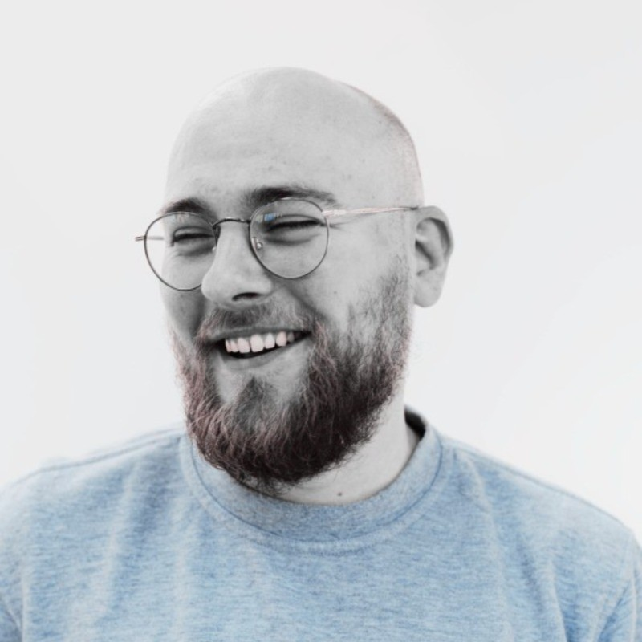
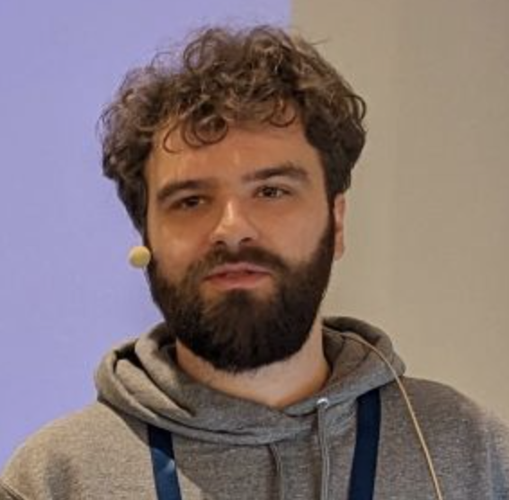
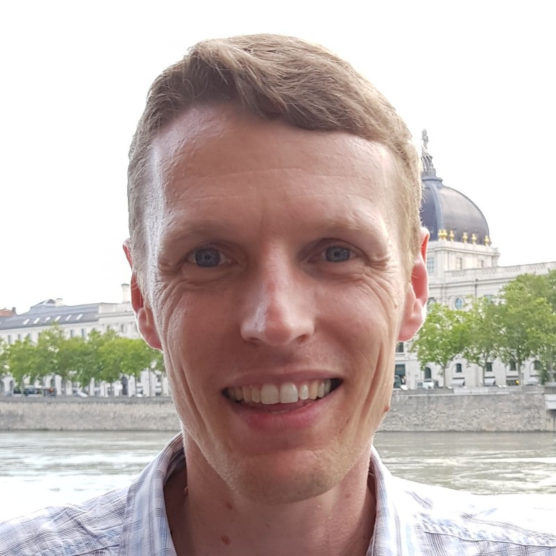

# A propos du PG Day France

Le PGDay France est un moment de rencontres et de conférences pour la communauté
francophone de PostgreSQL.

Les conférences s'adressent à tous les utilisateurs du logiciel : étudiants,
administrateurs systèmes, DBA, développeurs, chefs de Projets,
décideurs, etc... suivant les valeurs énoncées dans le Code De Conduite.

Il se tient depuis 2008 et chaque édition à lieu dans une ville différente, avec
pour ambition de faire naître ou faire grandir une communauté locale. Les précédentes
éditions ont eu lieu à Toulouse, Lille, Toulon, Marseille, Lyon, Nantes, Montpellier, Strasbourg.

## Contact

Pour toute information, adressez vos messages à [contact@pgday.fr](mailto:contact@pgday.fr).

### Code de Conduite

L'équipe de PG Day France et l'association PostgreSQLFr attachent une importance
à la participation de tous les membres de la communauté PostgreSQL et souhaitent
que chaque participant vive une expérience positive. Dans cette optique, nous
attendons de tous les participants qu'ils fassent preuve de respect et de
courtoisie envers les autres participants pendant toute la durée des événements
de l'association et des événements affiliés à PostgreSQLFr.

Tous les représentants/participants, conférenciers, exposants, organisateurs et
bénévoles aux événements de PostgreSQLFr doivent se conformer à notre
[code de conduite](/codedeconduite).

### Finances

L'organisation d'une journée de conférence ne serait pas possible sans le soutien
des sponsors ou la vente des billets. Si les recettes de l'événement sont
excédentaires, les bénéfices seront reversés à l'association PostgreSQLFr.

Cette association à but non lucratif vise à la promotion de PostgreSQL dans
les pays francophones. Aucun conférencier n'est rémunéré pour sa présentation,
même si ses frais de déplacement peuvent dans certains cas lui être remboursés.

L'équipe organisatrice est quant à elle entièrement constituée de bénévoles.

### Comité de sélection

Le comité de sélection 2024 est composé des personnes suivantes :

  

    
    
Anaïs Oberto   Software Engineer @ CNRS

  

  

    
    
Matthieu Cornillon   Senior Solution Architect @ Aiven

  

  

    
    
Yoann La Cancellera   Senior Support engineer @ Percona

  

  

    
    
Cedric Duprez   Expert bases de données @ IGN

  

