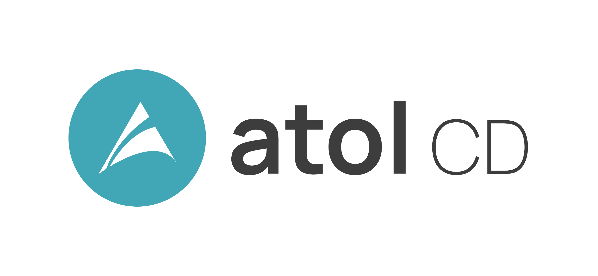
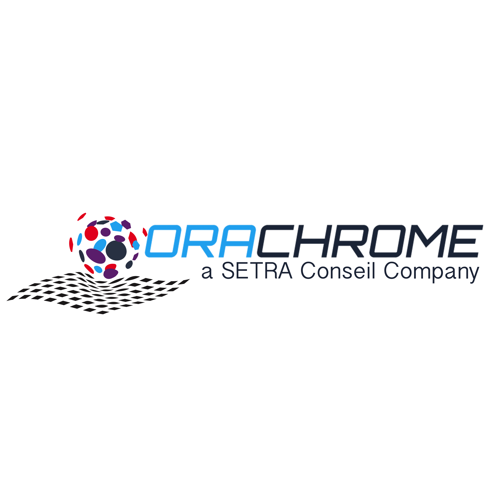

<h1>Le rendez-vous annuel de la communauté PostgreSQL ! </h1>

> Le PG Day France est un moment de rencontres et de conférences pour la
> communauté francophone de PostgreSQL. Les conférences s'adressent à tous
> les utilisateurs du logiciel : étudiants, administrateurs systèmes, DBA,
> développeurs, chefs de projets, décideurs, etc

<h2>L'édition 2023 se tiendra le 19-20 juin à Strasbourg</h2>

<!--<h3><a href='/appel'>l'appel à orateur est ouvert</a></h3>-->

  

    <a href="/programme" type="button" class="btn btn-primary btn-lg btn-block">Programme en ligne !</a>
  

  

<iframe width="560" height="315" src="https://www.youtube.com/embed/videoseries?list=PL8hcbCbHVHQmSpvAHgPUAz3y-mxEccg0I" title="YouTube video player" frameborder="0" allow="accelerometer; autoplay; clipboard-write; encrypted-media; gyroscope; picture-in-picture" allowfullscreen></iframe>

Vous pouvez consulter les vidéos des éditions précédentes sur
[notre chaine Youtube](https://www.youtube.com/channel/UCR7skKC85Zn6p7fJ-lW7G8g)

<!--

### Nos partenaires

        

          
        

        

            
          

        

          
        

        

          
        

        

          
        

        

          
        

        

          
        

        

          
        

        

          
        

        

          
        

        

          
        

        

          
        

      

-->

