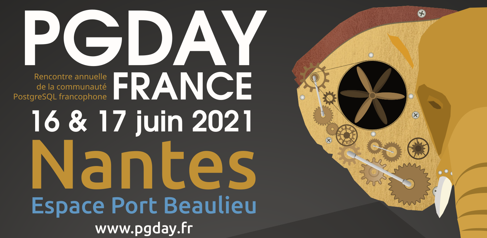

Le PG Day France est un moment de rencontres et de conférences pour la
communauté francophone de PostgreSQL. Les conférences s'adressent à tous
les utilisateurs du logiciel : étudiants, administrateurs systèmes, DBA,
développeurs, chefs de projets, décideurs, etc

<b>L'édition 2021 se tiendra le 16-17 juin à Nantes</b>

<!-- <a href='/appel'>l'appel à orateur est ouvert</a> !-->

 
Vous pouvez consulter les vidéos des éditions précédentes sur
<a href="https://www.youtube.com/channel/UCR7skKC85Zn6p7fJ-lW7G8g">notre chaine Youtube</a>.

<h3>Nos partenaires</h3>

 <!--
        

          
        

        

            
          

        

          
        

        

          
        

        

          
        

        

          
        

        

          
        

        

          
        

        

          
        

        

          
        

        

          
        

        

          
        

      

-->

 

<h4>Le PGDay France est un évènement de la communauté francophone de PostgreSQL</h4>

Vous pouvez vous aussi contribuer à la préparation de l'évenement. Pour
      plus d'information merci de consulter la page <a
      href="contribuer.html">Contribuer</a>
      

