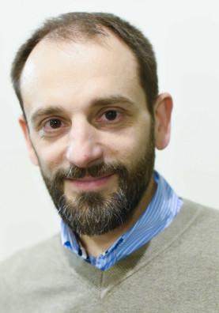
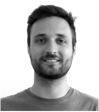
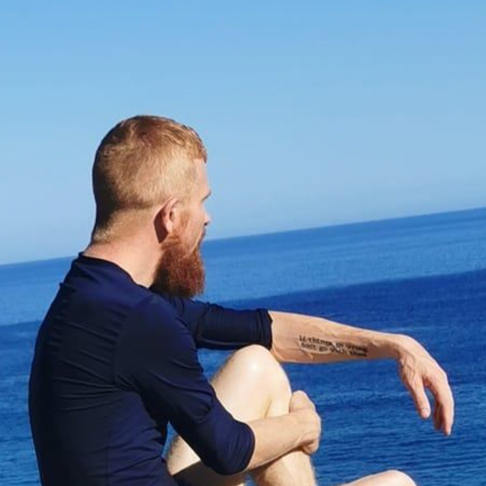
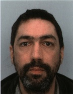

# Oratrices & Orateurs

  

  
  

  

  <h3>Stefan Fercot</h3>
  Data Egret
  

  En tant qu'Expert PostgreSQL, Stefan apporte à Data Egret près de 15 ans d'expertise dans le domaine des bases de données, avec une vaste expérience en support et conseil client. Il est actif au sein de la communauté et fait notamment partie des contributeurs de pgBackRest.
  

  

    Présentation:
    <a href='/programme'>Démystifier les sauvegardes incrémentales dans l'écosystème PostgreSQL</a>
  

  

  

  
  

  

  <h3>Cédric Villemain</h3>
  Expert PostgreSQL chez Data Bene
  

    Intéressé par les problématiques de Haute-Disponibilité et de qualité de service, Cédric contribue aux différents projets qu'il utilise et promeut.
  

  

    Présentation:
    <a href='/programme'>Le sharding sans complexité</a>
  

  

  

  
  

  

  <h3>Jérémie	Grauer</h3>
  NeoX-IT
  

  Sysadmin Linux chevronné, Jérémie utilise et torture PostgreSQL depuis 2012.
Responsable Infrastructure chez Cosium, hébergeur et éditeur de logiciels. Il supervise l'ensemble du stack technique : du choix des composants des serveurs aux réglages des middlewares et des logiciels métiers.
  

  

  

    
  

  

  <h3>Damien	Clochard</h3>
  DALIBO
  

    Damien Clochard est actif au sein de la communauté PostgreSQL à différents niveaux, notamment en tant que vice-président de l'association PostgreSQLFr et développeur principal du projet PostgreSQL Anonymizer. Il est Product Owner chez DALIBO, une société qu'il a co-fondé en 2005.
  

  

    Présentation:
    <a href='/programme'>Développer une extension Postgres en Rust</a>
  

  

  

    
  

  

  <h3>Stéphane Schildknecht</h3>
  LOXODATA
  

Stéphane Schildknecht a contribué à la fondation de l'association PostgreSQLFr, qu'il a présidé de 2005 à 2010.
DBA certifié PostgreSQL, consultant en bases de données pendant 20 ans, il a fondé LOXODATA en 2010.
Stéphane est contact régional PostgreSQL pour l'Europe francophone.
  

  

  

    
  

  

  <h3>Florent	Jardin</h3>
  DALIBO
  

    Je suis originaire de Lille et j'y travaille depuis chez moi en tant que consultant
pour Dalibo, une société coopérative qui œuvre à la promotion et l'amélioration de
l'écosystème de PostgreSQL au quotidien.
  

  

  

    
  

  

  <h3>Julien	WADDLE</h3>
  Camptocamp
  
Cartographe puis géomaticien je suis tombé dans le monde OpenSource en 2012.
Fan de Python, QGIS et du SQL, j'adore trouver des solutions efficaces pour simplifier les processus liés aux données utilisées dans la cartographie.
  

  

  

    
  

  

  <h3>Julien Acroute</h3>
  Camptocamp
  
Je suis passionné par l'open source et en particulier par PostgreSQL. J'ai écrit et animé des formations sur Kubernetes, Docker, PostgreSQL, et sur la conception d'applications ""cloud native"". Le développement et l'audit composent le reste de mon activité.
On a tous besoin d'un PostgreSQL !
  

  

<!--

  

  
  

  

  <h3>Sarah Haïm-Lubczanski</h3>
  Documentation Architect chez Bedrock Streaming
  

  Documentation Architect après avoir été formatrice, puis développeuse, j'ai toujours préféré le contact des informaticien-ne-s spécialistes à celui du grand public, et cela a bien fonctionné car je m'occupe de documentation.
  

  

    Présentation:
    <a href='/programme'>Améliorons ensemble la documentation</a>
  

  

  

  
  

  

  <h3>Sébastien Sire</h3>
  Consultant chez EDB
  

  Je travaille depuis 25 ans sur différents sujets liés aux bases de données : développement, conception, modélisation, migration et administration. Après avoir exercé sur la majorité des moteurs du marché, j'ai rejoint EDB en 2022 pour me consacrer pleinement à PostgreSQL.
  

  

    Présentation:
    <a href='/programme'>Les différentes fonctionnalités de sécurité dans Postgres</a>
  

  

  

  
  
  
  

  

  <h3>Yohann Martin, Clément Paillier et Ludovic Augereau</h3>
  Experts base de données chez MAIF
  

  Membre actif du PGGTIE depuis 2006, nous pratiquons PostgreSQL depuis la version 9.0.
  

  

    Présentation:
    <a href='/programme'>Automatisation « IaaS » du déploiement et du MCO de PostgreSQL pour la MAIF avec Ansible</a>
  

  

  

  
  

  

  <h3>Matthieu Cornillon</h3>
  Aiven
  

    Amoureux des bases de données depuis toujours, Postgres et l'Open Source ont une place particulière dans mon cœur. Après 7 années à travailler chez ADEO en tant que Tech Lead, j'accompagne aujourd'hui les entreprises qui font le choix de l'Open Source avec Aiven.
  

  

    Présentation:
    <a href='/programme'>De la feuille à l'éléphant</a>
  

  

  

  
  

  

  <h3>Pierre-Alexandre Voye</h3>
  Consultant chez Green Software Solutions
  

  Programmeur depuis mon enfance et utilisateur invétéré de PostgreSQL depuis 2005, je suis ingénieur R&D, développeur et actuellement consultant PostgreSQL pour projet d'envergure pour le compte de la DGFIP.
  

  

    Présentation:
    <a href='/programme'>Moteur de Recherche Plein Texte Sémantique en PostgreSQL </a>
  

  

§
-->
