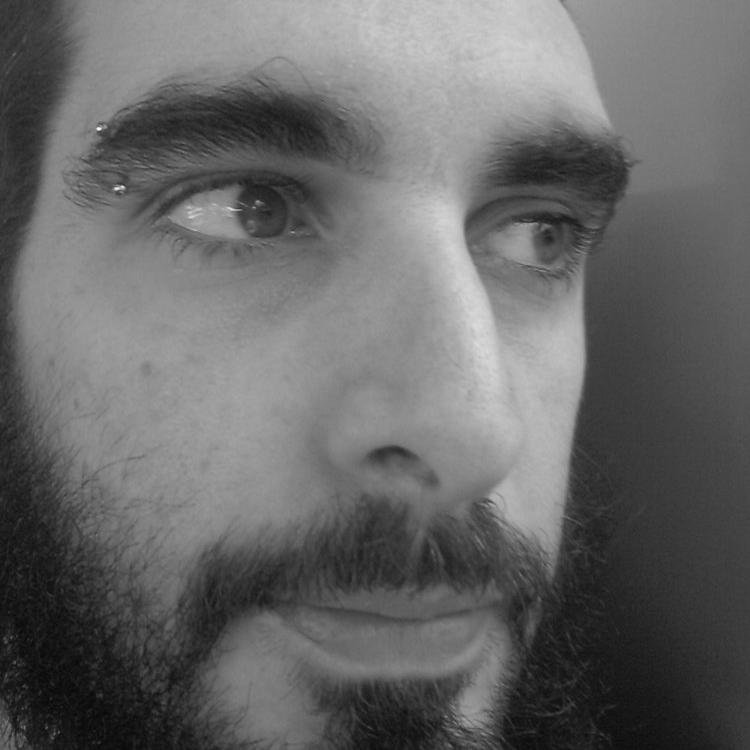
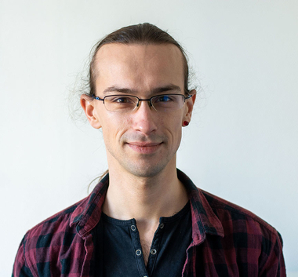
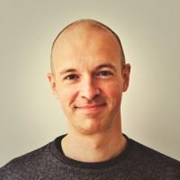
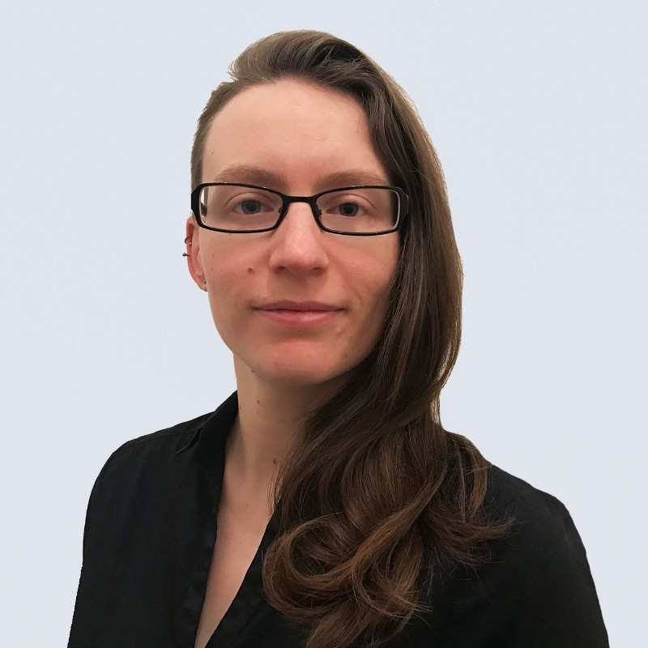
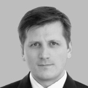
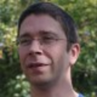

# Oratrices & Orateurs

<h3>Damien Clochard</h3>
DBA PostgreSQL chez DALIBO

Damien Clochard est actif au sein de la communauté PostgreSQL à
différents niveaux, notamment en tant que président de l'association
PostgreSQLFr et développeur principal du projet PostgreSQL Anonymizer.
Il est DBA chez DALIBO, une société qu'il a co-fondé en 2005.

Présentation:
<a href='/programme'>Estimer l'empreinte écologique de PostgreSQL</a>

<h3>Vincent Graillot</h3>
Responsable Recherche et Innovation chez UMANIT

Avec un fort goût du challenge, Vincent aime quitter sa zone de confort pour
des projets innovants et complexes. Adorateur de PostgreSQL depuis des années,
il l'utilise au quotidien, l'enseigne et le partage à ses collègues et à
l'école centrale de Nantes.

Présentation:
<a href='/programme'>Heu, il faut chiffrer les données de la base ! On fait comment ?</a>

<h3>Frédéric Delacourt</h3>
Consultant chez Data Bene

De 2006 à 2016, dans un contexte centre de R&D Télécoms, Frédéric a adressé les problèmes de performances,
de sauvegarde, de fail over automatique,... PostgreSQL pour des clients comme Softbank, Bezeq ou Orange.
Actuellement, Frédérique est consultant PostgreSQL chez Data bene, anciennement 2ndQuadrant France.

Présentation:
<a href='/programme'>Règles de paramétrage de PostgreSQL</a>

<h3>David Baffaleuf</h3>
Responsable AllDB chez CAP DATA CONSULTING

 David est expert SQL Server, MySQL / MariaDB et PostgreSQL, avec une touche de MongoDB. Il est product owner et développeur back end de la plateforme DBA à distance de Cap Data, et manage l'équipe. Il est également ancien SQL Server MVP, consultant, formateur et speaker.

Présentation:
<a href='/programme'>pg_stat_statements ou comment savoir où ça fait mal</a>

<h3>Laure-Hélène Bruneton</h3>
Ingénieure Etudes et Développement chez CAMPTOCAMP

Géomaticienne de formation, Laure-Hélène a travaillé 10 ans dans une société d'édition
de logiciels d'urbanisme, domaine où le SIG est une thématique forte. Elle arejoint l'an
dernier la société Camptocamp, sur le projet NexSIS, pour lequel elle est en charge de
l'étude et du développement du service de calcul d'itinéraires.

Présentation:
<a href='/programme'>pgRouting comme aide à la décision des Services d'Incendie et de Secours</a>

<h3>Guenaël Gonnord</h3>
Ingénieur système chez Loxodata

Guénaël est tombé dans l'informatique quand il était petit. Professionnel de l'informatique
depuis plus de 20 ans, il bascule du monde propriétaire vers l'Open Source dès 2004.
Convaincu par ce modèle, il rejoint LOXODATA en 2019 en tant qu'ingénieur système.

Présentation:
<a href='/programme'>REX PostgreSQL managé (Google Cloud SQL)</a>

<h3>Franck BOUDEHEN</h3>
DBA Consultant chez DALIBO

Présentation:
<a href='/programme'>Haute disponibilité multi sites avec PostgreSQL</a>

<h3>Cédric Villemain</h3>
Expert PostgreSQL chez Data bene

Intéressé par les problématiques
de Haute-Disponibilité et de qualité de service, il contribue aux différents
projets qu'il utilise et promeut.

Présentation:
<a href='/programme'>Partitionnement automatique avec PostgreSQL</a>

