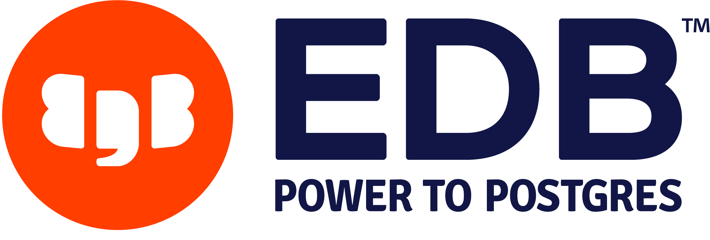
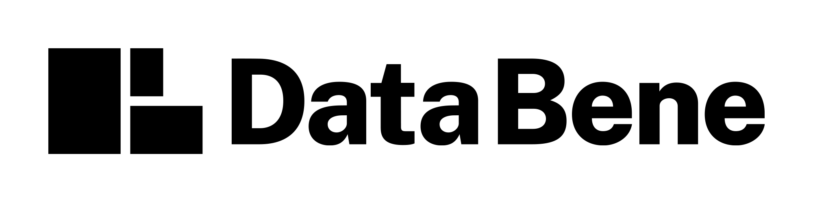

Le PG Day France ne serait pas possible sans le soutien des entreprises de
la communauté PostgreSQL. Nous remercions chaleureusement nos partenaires
pour leur aide et leur présence à nos cotés.

### PARTNERS

<!--

-->

<!--

-->

<!--
### Nos partenaires SILVER

-->

<!--
### Nos partenaires BRONZE

-->

<!--
##  Devenez partenaire du PGDay France

**IMPORTANT**: Cette année le nombre de PARTNERS est limité à 5.

<table class="table">
  <thead>
    <tr>
      <th>Avantages</th>
      <th>SUPPORTER</th>
      <th>PARTNER</th>
    </tr>
  </thead>
  <tr>
    <th>Logo sur la page d'accueil du site web</th>
    <td>Oui</td>
    <td>Oui</td>
  </tr>
  <tr>
    <th>Diffusion d'une vidéo promotionnnelle</th>
    <td>Oui</td>
    <td>Oui</td>
  </tr>
  <tr>
    <th>Logo sur les videos (Youtube)</th>
    <td></td>
    <td>Oui</td>
  </tr>
  <tr>
    <th>Logo sur toutes les pages du site web</th>
    <td></td>
    <td>Oui</td>
  </tr>
  <tr>
    <th>Invitations VIP</th>
    <td>2</td>
    <td>4</td>
  </tr>
  <tr>
    <th>Bandeau promotionnel (2mx1m max.) dans la salle de conférence</th>
    <td></td>
    <td>Oui</td>
  </tr>
  <tr>
    <th>Stand</th>
    <td></td>
    <td>Oui</td>
  </tr>
  <tr>
      <th>Tarif</th>
      <td>750€</td>
      <td>3000€</td>
    </tr>
</table>

Les PARTNERS pourront distribuer leur matériel promotionnel sur leur stand.

Les SUPPORTERS pourront mettre à disposition sur le stand d'accueil une page A4 et 1 cadeau promotionnels.

## Liens

* [Contract (EN)](https://github.com/postgresqlfr/contrats/raw/master/2023.pgday.fr/pgdayfrance_2023_sponsorship_contract_v13.pdf)

-->
