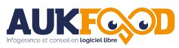
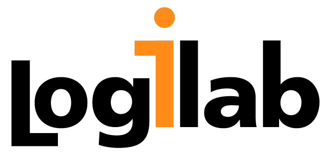

Le PG Day France ne serait pas possible sans le soutien des entreprises de
la communauté PostgreSQL. Nous remercions chaleureusement nos partenaires
pour leur aide et leur présence à nos cotés.

### Nos Partenaires GOLD

<!--

      

  

-->

### Nos partenaires SILVER

<!--

### Nos partenaires BRONZE

-->

<h3>
  Devenez partenaires du PGDay France
</h3>

<table class="table">
  <thead>
    <tr>
      <th>Avantages</th>
      <th>Bronze</th>
      <th>Silver</th>
      <th>Gold</th>
    </tr>
  </thead>
  <tr>
    <th>Logo sur la page d'accueil du site web</th>
    <td>Oui</td>
    <td>Oui</td>
    <td>Oui</td>
  </tr>
  <tr>
    <th>Logo sur les videos (Youtube)</th>
    <td></td>
    <td></td>
    <td>Oui</td>
  </tr>
  <tr>
    <th>Logo sur toutes les pages du site web</th>
    <td></td>
    <td>Oui</td>
    <td>Oui</td>
  </tr>
  <tr>
    <th>Invitations VIP</th>
    <td>1</td>
    <td>3</td>
    <td>6</td>
  </tr>

  <tr>
    <th>Matériel promotionnel dans le sac de conférence (A4 recto-verso)</th>
    <td>1 pages</td>
    <td>2 pages</td>
    <td>4 pages</td>
  </tr>
  <tr>
    <th>Cadeaux promotionnels dans le sac de conférences</th>
    <td></td>
    <td>1</td>
    <td>2</td>
  </tr>
  <tr>
    <th>Bandeau promotionnel (2mx1m max.) dans la salle de conférence</th>
    <td></td>
    <td></td>
    <td>Oui</td>
  </tr>
  <tr>
    <th>Stand</th>
    <td></td>
    <td></td>
    <td>Oui</td>
  </tr>
  <tr>
    <th>Liste des adresses e-mail des participants (en opt-in)</th>
    <td></td>
    <td></td>
    <td>Oui</td>
  </tr>
  <tr>
      <th>Tarif</th>
      <td>400€</td>
      <td>1500€</td>
      <td>3000€</td>
    </tr>
</table>

 

<ul>
  <li>
    <a href="https://postgresqlfr.gitlab.io/contrats/2022.pgday.fr/pgdayfrance_2022_sponsorship_contract_v11_french.pdf">Contrat (FR)</a>
  </li>
  <li>
    <a href="https://postgresqlfr.gitlab.io/contrats/2022.pgday.fr/pgdayfrance_2022_sponsorship_contract_v11.pdf">Contract (EN)</a>
  </li>
</ul>

