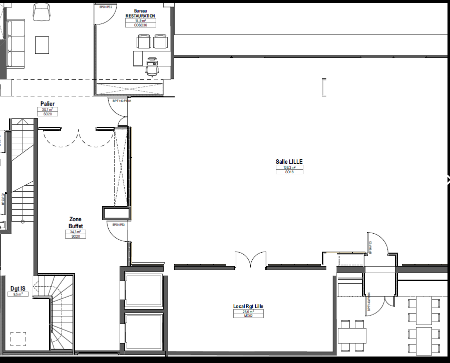

# Programme

## Mardi 11 juin 2024

  
10h00

  

  
  

  
<h3>Ouverture des portes</h3>

  
10h30

  

  <i class="fa fa-laptop"></i>
  

  

  <h3>Atelier : Autotuning de PostgreSQL</h3>
  
Par <a href="orateurs#l_nardi" class="pg_speaker_name">Luigi Nardi</a> - dbtune

  

Venez explorer le monde complexe de l'optimisation avec PostgreSQL, où ce système de gestion de bases de données revèle une multitude de paramètres de configuration qui gouvernent son fonctionnement. Avec l'évolution constante du système, le nombre croissant et la complexité de ces paramètres mettent en lumière l'importance de leurs configurations adaptées pour optimiser les performances d'une application et l'utilisation des ressources dans le Cloud.
  

  
<i>Entrée libre dans la limite des places disponibles.</i>

  

  Prérequis pour la session : Apporter un ordinateur portable équipé d'un client SSH et d'un navigateur Chrome, Firefox ou Safari.
  Il n'y a pas besoin d'un système d'exploitation particulier car la formation se déroulera sur AWS.
  

  

  
10h30

  

  
  

  

  <h3>Plongez au Cœur de PostgreSQL </h3>
  
Par <a href="orateurs#c_villemain" class="pg_speaker_name">Cédric Villemain</a> - databene

  

  Atelier de 2 heures dédié à toutes celles et ceux qui travaillent avec ce puissant moteur de base de données. Cette rencontre interactive vous permettra d'explorer des sujets tels que l'utilisation des statistiques dans PostgreSQL et  la gestion des accès, tout en conservant un esprit joueur: « Saurons-nous faire planter PostgreSQL violemment » ? Chacune et chacun pourra apporter ses propres sujets de discussion, y compris avec vos propres visuels. Ce format privilégié favorise l'échange dynamique et l'apprentissage mutuel, loin des cadres rigides des conférences traditionnelles. Ne manquez pas cette occasion unique de partager vos expériences et de découvrir de nouvelles perspectives sur PostgreSQL !
  

  

  <i>Entrée libre dans la limite des places disponibles.</i>
  

  

  
12h00

  

  <i class="fa fa-spinner"></i>
  

  

  <h3>Pause</h3>
  
 Le repas du mardi midi n'est pas inclus. 

  
 Une pause de 2h est prévue pour se restaurer à l'extérieur 

  
 Merci de votre compréhension

  

  
14h00

  

  
  

  

  <h3>Ré-Ouverture des portes</h3>
  

  
14h30

  

  
  

  

  <h3>Mot d'accueil</h3>
  
Par Mathieu Cornillon & Anthony Nowocien

  

  
14h45

  

  
  

  

  <h3>Démystifier les sauvegardes incrémentales dans l'écosystème PostgreSQL</h3>
  
Par <a href="orateurs#s_fercot" class="pg_speaker_name">Stefan Fercot</a> - Data Egret

  

  Avec PostgreSQL 17 Beta1 fraîchement publiée, <b>pg_basebackup</b> vous permet désormais d'effectuer des sauvegardes incrémentales. Cette nouvelle fonctionnalité introduit plusieurs nouveaux paramètres et outils pour vous faciliter cette tâche. 
  En commençant par une présentation étape par étape de l'utilisation des extraits des journaux de transaction (<i>"WAL summaries"</i>) et de la copie incrémentale des données avec <b>pg_basebackup</b>, nous examinerons ensuite quand (et comment) le nouvel outil <b>pg_combinebackup</b> doit être employé. 
  Après avoir rapidement discuté de la politique de rétention, nous dévoilerons ensuite certains des aspects que nous pourrions attendre de cette fonctionnalité, mais qui ne sont pas (encore) disponibles. 
  Enfin, nous comparerons rapidement cette nouvelle fonctionnalité avec les sauvegardes incrémentales au niveau "blocs" de pgBackRest.
  

  

  
15h30

  

  
  

  

  <h3>Postgres: des histoires qui font peur</h3>
  
Par <a href="orateurs#" class="pg_speaker_name">Jérémie Grauer</a> - NeoX-IT

  

  On raconte toujours les réussites techniques PostgreSQL, les moments incroyables où tous les meilleurs choix ont été faits dès le départ et que tout se déroule conformément au plan. Mais la réalité est souvent bien différente. Voyons ensemble l'envers du décor, lorsque tout se passe mal, lorsque la loi de Murphy est à son comble et que vous découvrez avec horreur que vous avez un vrai problème, le plus souvent en production. Cette présentation parlera de cas réels, un retour d'expérience de plus de 10 ans d'exploitation de PostgreSQL. Et comme on apprend toujours de ses erreurs, cela nous permettra d'en tirer de précieux enseignements.
  

  

  
16h15

  

  
  

  

  <h3>Pause</h3>
  

  
16H45

  

  
  

  

  <h3>Développer une extension Postgres en Rust</h3>
  
Par <a href="orateurs#d_clochard" class="pg_speaker_name">Damien	Clochard</a> - DALIBO

  

Prêts à plonger dans le monde passionnant des extensions PostgreSQL ?

Après un tour d'horizon des différents frameworks de developpement disponibles ( PGXS, pg_tle, PGZX ), nous ferons un zoom sur PGRX à travers 4 exemples concrets qui illustrent les avantages du langage Rust dans ce contexte : sécurité, puissance et performances... Grace aux avancées récentes dans le domaine, il n'a jamais été aussi simple de créer une extension et déployer du code robuste et flexible au plus près de la donnée.
  

  

  
17h15

  

  
  

  

  <h3>Lightning Talk</h3>
  

    Une série de lightning talks de 5 minutes. Chaque participant au PG Day peut choisir le sujet de son choix (technique ou non) et le présenter en 5 minutes top chrono ! :)
    Envoyez vos propositions à <a href="mailto:contact@pgday.fr">contact@pgday.fr</a>
  

  

  
17h45

  

  
  

  

  <h3>Mot de clôture</h3>
  

## Grande soirée communautaire

  
19h30 - 23h00

    

  
  

  

  <h3>Grande soirée ouverte à tous et incluse dans le prix de votre billet.</h3>
  
A deux pas du lieu de l'événement, tous les participants, sponsors et orateurs se retrouvent pour une grande soirée de rencontre et de partage autour d'un apéritif dînatoire.

  
Lieu de Rendez-vous : <strong>Le HEIN - Brique House</strong>, 13 Pl. Saint-Hubert, 59800 Lille

  

## Mercredi 12 juin 2024

  
09h00

  

  
  

  

  <h3>Ouverture des portes</h3>
  

  
09h15

  

  
  

  

  <h3>Le sharding sans complexité</h3>
  
Par <a href="orateurs#c_villemain" class="pg_speaker_name">Cédric	Villemain</a> - Data Bene

  

Citus Data est une extension de PostgreSQL qui étend ce fameux serveur de
bases de données relationnelles pour concevoir des bases distribuées.

Calculs répartis, multi-tenant avec clients isolés, resharding sans downtime, ...

Si cela vous évoque déjà quelque chose, vous en apprendrez d'avantage. Et sinon
vous saurez enfin ce qu'est une architecture multi-tenant ... et que le sharding
c'est facile!

Inévitable pour votre projet avec des téraoctets de données à stocker, traiter,
restituer.
  

  

  
09h45

  

  
  

  

  <h3>Faire vivre une communauté, retour d'expérience du Meetup PostgreSQL Lille</h3>
  
Par <a href="orateurs#f_jardin" class="pg_speaker_name">Florent	Jardin</a> - Dalibo

  

Les groupes « Meetup » sont un moyen local et efficace pour réunir un public autours d'une technologie. En France, on en dénombre cinq sur la plateforme éponyme dédié à PostgreSQL. Cependant, leur régularité repose sur une poignée de volontaires, mettant en péril l'accès à ce format pour de nombreuses personnes.

Dans cette conférence, je présenterai l'histoire du groupe et de ses membres, les préparatifs nécessaires pour mettre sur pied une soirée Meetup, ainsi que les efforts pour être reconnu comme un « PostgreSQL User Group » par la communauté internationale.
  

  

  
10h30

  

  
  

  

  <h3>Pause</h3>
  

  
11h00

  

  
  

  

  <h3>Table ronde du Groupe de Travail Inter-Entreprises</h3>
  Débats et Retours d'expérience autour de l'actualité du
  <a href='https://www.postgresql.fr/entreprises:accueil'>Groupe de Travail Inter-Entreprises</a>
  

  
12h00

  

  
  

  

  <h3>Repas</h3>
  

  
14h00

  

  
  

  

  <h3>Gérer la sécurité dans PostgreSQL : De l'accès au serveur à la donnée</h3>
  
Par <a href="orateurs#s_schildknecht" class="pg_speaker_name">Stéphane	Schildknecht</a> - LOXODATA

  

Avec l'augmentation de la valeur des données en entreprise, il est crucial pour tout projet informatique d'intégrer la question de la sécurisation des accès aux données dès la phase de conception.

Utilisant l'analogie avec les châteaux forts, nous détaillerons les niveaux de protection offerts par PostgreSQL, depuis la restriction des accès aux serveurs de bases de données, jusqu'au contrôle de l'accès à une donnée en fonction des droits sur une colonne ou une ligne.

Nous préciserons à quel besoin répond chaque niveau, et quel type de sécurisation chaque solution offre aux équipes.
  

  

  
14h45

  

  
  

  

  <h3>H3 Indexing</h3>
  
Par <a href="orateurs#j_waddle" class="pg_speaker_name">Julien	WADDLE</a> - Camptocamp

  

H3 est un système d'indexation géospatiale créé par Uber, qui divise la surface terrestre en cellules hexagonales pour une analyse spatiale efficace. Il est conçu pour améliorer les requêtes spatiales, comme la mesure des distances et la détection de cellules adjacentes. En s'intégrant à PostgreSQL, H3 renforce la capacité de cette base de données à traiter et analyser les données géospatiales, offrant aux utilisateurs une précision et une efficacité accrues dans des domaines tels que la cartographie, la logistique, et la planification urbaine.
  

  

  
15h15

  

  
  

  

  <h3>Lightning Talk</h3>
  

    Une série de lightning talks de 5 minutes. Chaque participant au PG Day peut choisir le sujet de son choix (technique ou non) et le présenter en 5 minutes top chrono ! :)
    Envoyez vos propositions à <a href="mailto:contact@pgday.fr">contact@pgday.fr</a>
  

  

  
16h15

  

  
  

  

  <h3>Pause</h3>
  

  
16h45

  

  
  

  

  <h3>Migration Maîtrisée de PostgreSQL à Grande Échelle</h3>
  
Par <a href="orateurs#j_acroute" class="pg_speaker_name">Julien Acroute</a> - Camptocamp

  

Découvrez comment automatiser complètement les mises à jour majeures de PostgreSQL et PostGIS, tout en corrigeant dynamiquement les procédures stockées bloquantes. Prévoyez le chemin de mise à jour des paquets système et estimez le downtime, le tout testé avec des conteneurs Docker. Réduisez le downtime à environ 20 minutes pour des clusters volumineux, passant de PostgreSQL 10 à 14 et de PostGIS 2.3 à 3.2, sur des machines virtuelles.
  

  

  
17h15

  

  
  

  

  <h3>Mot de clôture</h3>
  

  
17h30

  

  <h3>FIN</h3>
  

<!--

<!--

  
10h30

  

  
  

  

  <h3>Pause</h3>
  

  
10h45

  

  
  

  

  <h3>Améliorons ensemble la documentation</h3>
  
Par <a href="orateurs#sarah_haim_lubczanski" class="pg_speaker_name">Sarah Haïm-Lubczanski</a> - Bedrock Streaming

  

  La documentation est le meilleur moyen de rassembler le savoir et de rendre les informations disponibles pour le plus grand nombre et de faire progresser tout le monde, des personnes débutantes aux plus avancées dans PostgreSQL. Prenons quelques pages de documentation de votre logiciel préféré, et examinons comment nous pourrions les améliorer. Avec quelques efforts sur le contenu et la présentation, votre documentation pourrait être plus lisible, et plus utile à la communauté. Quelques astuces pour produire directement une bonne documentation sont également au menu, tout comme l'art de relire une documentation existante.
  

  

  <a href="/docs/2023/04_Lets-make-it-better-now-together.pdf">
  <i class="fa fa-desktop" aria-hidden="true"></i>Support de la présentation</a>
  

  <!--
  

  <a href="#">
  <i class="fa fa-youtube-play" aria-hidden="true"></i>Vidéo
  </a>
  

  

  -->

<!--

  
11h30

  

  
  

  

  <h3>Les différentes fonctionnalités de sécurité dans Postgres</h3>
  
Par <a href="orateurs#sebastien_sire" class="pg_speaker_name">Sébastien Sire</a> - EDB

  

  La sécurité des données est une préoccupation croissante pour les organisations de toutes tailles. Dans ce contexte, Postgres a développé au fil des ans une solide réputation en matière de sécurité, offrant des fonctionnalités robustes pour protéger les données sensibles. Cette présentation examinera les différentes fonctionnalités de sécurité intégrées à Postgres telles que la gestion des utilisateurs, les gestion des accès, les ACL, le chiffrement de données, la journalisation et la vérification d'intégrité.
  

  <!--
  

  <a href="#">
  <i class="fa fa-desktop" aria-hidden="true"></i>Support de la présentation</a>
  

  

  <a href="#">
  <i class="fa fa-youtube-play" aria-hidden="true"></i>Vidéo
  </a>
  

  

  -->

<!--

  
12h15

  

  
  

  

  <h3>Repas</h3>
  

  
14h00

  

  
  
  
  

  

  <h3>Automatisation « IaaS » du déploiement et du MCO de PostgreSQL pour la MAIF avec Ansible</h3>
  
Par <a href="orateurs#yohann_martin" class="pg_speaker_name">Yohann MARTIN, Clément PAILLIER et Ludovic AUGEREAU</a> - MAIF

  

  Postgres en IAAS avec Ansible à la MAIF :
  - objectif de l'industrialisation,
  - architecture de déploiement,
  - description de l'industrialisation sous Ansible,
  - focus sur le projet Ansible.
  

  

  <a href="/docs/2023/06_Yohann_Martin_Automatisation_du_deploiement_IAAS.pdf">
  <i class="fa fa-desktop" aria-hidden="true"></i>Support de la présentation
  </a>
  

  <!--
  

  <a href="#">
  <i class="fa fa-youtube-play" aria-hidden="true"></i>Vidéo</a>
  

  

  -->

<!--

  
14h45

  

  
  

  

  <h3>De la feuille à l'éléphant</h3>
  
Par <a href="orateurs#matthieu_ornillon" class="pg_speaker_name">Matthieu Cornillon</a> - Aiven
  

  

  Un développeur m'a dit un jour "faire du SQL c'est juste ringard, Mongo, ça c'est sexy !". Mais notre cher Éléphant n'a pas dit son dernier mot !
  Après un bref KO technique, j'en suis venu à la conclusion que de nombreux choix de moteurs sont faits de cette façon ces jours-ci : par la voix des développeurs et de leur perception de la technologie. Et il se trouve que Postgres n'a pas toujours la cote.
  Cette conférence, à mi-chemin entre une comparaison fonctionnelle et un retour d'expérience, s'adresse à tous les développeurs, DBAs, architectes qui ont déjà eu à choisir entre Mongo et Postgres, et à tout ceux qui essayent de construire un argumentaire sur le moteur à choisir pour les bons cas d'usage.
  Let's make Postgres sexy again!
  

  

  <a href="/docs/2023/07_Matthieu_Cornillon_De_la-feuille_a_lelephant.pdf">
  <i class="fa fa-desktop" aria-hidden="true"></i>Support de la présentation
  </a>
  

  <!--
  

  <a href="#">
  <i class="fa fa-youtube-play" aria-hidden="true"></i>Vidéo
  </a>
  

  

  -->

<!--

  
15h15

  

  
  

  

  <h3>Pause</h3>
  

  
15h45

  

  
  

  

  <h3>Moteur de Recherche Plein Texte Sémantique en PostgreSQL</h3>
  
Par <a href="orateurs#pierre_alexandre_voye" class="pg_speaker_name">Pierre-Alexandre Voye</a> - Green Software Solutions

  

  PostgreSQL est doté d'un système de recherche plein texte assez performant et rapide. On montrera comment transformer ce système en moteur de recherche sémantique.
  Cette présentation est un retour d'expérience d'écriture d'un moteur de recherche de métiers avec des capacités sémantiques, utilisant le ROME v4 de Pôle-Emploi.
  L'utilisateur propose un mot clé, même mal orthographié, qui n'appartient pas forcément à la fiche métier ou ses données. Par exemple, "bois" doit aussi renvoyer des fiches métiers concernant l'ameublement.
  Après avoir présenté le système de recherche plein texte de PostgreSQL, avec ses subtilités (calcul de radicaux, query, ranking), nous expliquerons comment introduire de la sémantique grâce à des notions de champs lexicaux et d'ontologie de mots (Wordnet). Nous aborderons rapidement le sujet de l'orthographe des mots-clés.
  

  <!--
  

  <a href="#">
  <i class="fa fa-desktop" aria-hidden="true"></i>Support de la présentation
  </a>
  

  

  <a href="#">
  <i class="fa fa-youtube-play" aria-hidden="true"></i>Vidéo
  </a>
  

  

  -->

<!--

  
16h15

  

  
  

  

  <h3>Lightning Talk</h3>
  

    Une série de lightning talks de 5 minutes. Chaque participant au PG Day peut choisir le sujet de son choix (technique ou non) et le présenter en 5 minutes top chrono ! :)
    Envoyez vos propositions à <a href="mailto:contact@pgday.fr">contact@pgday.fr</a>
  

  

  -->

<!--

  
17h15

  

  
  

  

  <h3>Mot de clôture</h3>
  

  -->

<!--

  
17h30

  

  <h3>FIN</h3>
  

  -->
