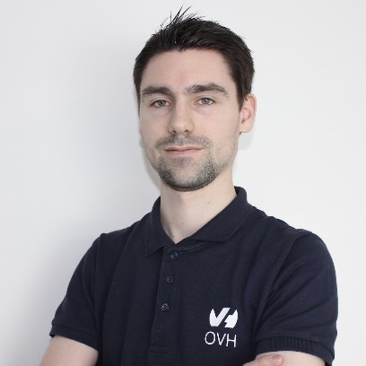

# Programme

## Mardi 21 juin 2021 - 14h

  
14h00
  

  

  
  

  

  <h3>Ouverture des portes</h3>
  

  
14h30

  

  
  

  

  <h3>Mot d'accueil</h3>
  

  
14h45

  

  
  

  

  <h3>Qui a besoin de RAC ?</h3>
  
Par <a href="orateurs#karen_jex" class="pg_speaker_name">Karen Jex</a> - CRUNCHY DATA

  

  Malgré son prix et sa complexité, Oracle RAC est souvent utilisé en réponse à des besoins de haute disponibilité/scalabilité. PostgreSQL n’a pas d’équivalent, mais est-ce qu’on en a vraiment besoin?
  

  <!--
  

  <a href="#">
  <i class="fa fa-desktop" aria-hidden="true"></i>Support de la présentation
  </a>
  

  

  <a href="#">
  <i class="fa fa-youtube-play" aria-hidden="true"></i>Vidéo
  </a>
  

  -->
  

  
15h30

  

  
  

  

  <h3>Migration vers PostgreSQL : mener de gros volumes de données à bon port (5432)</h3>
  
Par <a href="orateurs#philippe_beaudoin" class="pg_speaker_name">Philippe Beaudoin</a> - DALIBO

  

  Cette conférence présente une méthodologie et des techniques permettant de migrer de gros volumes de données vers PostgreSQL, le tout illustré avec l’outil Data2Pg.
  

  <!--
  

  <a href="#">
  <i class="fa fa-desktop" aria-hidden="true"></i>Support de la présentation
  </a>
  

  

  <a href="#">
  <i class="fa fa-youtube-play" aria-hidden="true"></i>Vidéo
  </a>
  

  -->
  

  
16h15

  

  
  

  

  <h3>Pause café</h3>
  

  
16h45

  

  
  

  

  <h3>Table ronde du PGGTIE</h3>
  

## Mardi 21 juin 2021

**Grande soirée communautaire, ouverte à tous et inclus dans le prix de votre billet.**

  
19h00 - 22h00

  

  <h3>Ouverture des portes</h3>
  A 2 pas des plages de Carnon et au bord du port de plaisance tout les participants, sponsors, speaker se retrouve pour une grande soirée de rencontre et de partage autour d'un apéritif dinatoire.
  

## Mercredi 22 juin 2021

  
09h00

  

  <h3>Ouverture des portes</h3>
  

  
09h30

  

  

  <h3>Mot d'accueil</h3>
  

  
09h45

  

  
  

  

  <h3>Instrumenter PostgreSQL avec Prometheus</h3>
  
Par <a href="orateurs#julien_acroute" class="pg_speaker_name">Julien Acroute</a> - CAMP TO CAMP

  

  Comment instrumenter un cluster PostgreSQL avec Prometheus et Grafana afin de récupérer des métriques sur le cluster, les bases, les tables et les requêtes.
  

  <!--
  

  <a href="#">
  <i class="fa fa-desktop" aria-hidden="true"></i>Support de la présentation</a>
  

  

  <a href="#">
  <i class="fa fa-youtube-play" aria-hidden="true"></i>Vidéo
  </a>
  

  -->
  

  
10h30

  

  
  

  

  <h3>Pause</h3>
  

  
10h45

  

  
  

  

  <h3>TDE: une autre approche via la création d'un nouveau type de données</h3>
  
Par <a href="orateurs#frederic_delacourt" class="pg_speaker_name">Frédéric Delacourt</a> - DATA BENE

  

  Pour le compte d'un client, nous avons réalisé une preuve de concept pour offrir un mécanisme de transparent data encryption via la création d'un nouveau type de données chiffrées.
  

  <!--
  

  <a href="#">
  <i class="fa fa-desktop" aria-hidden="true"></i>Support de la présentation</a>
  

  

  <a href="#">
  <i class="fa fa-youtube-play" aria-hidden="true"></i>Vidéo
  </a>
  

  -->
  

  
11h30

  

  
  

  

  <h3>Automatisation d'une mise à jour éléphantesque</h3>
  
Par <a href="orateurs#julien_riou" class="pg_speaker_name">Julien Riou</a> - OVH Cloud

  

  Faire le grand écart entre PostgreSQL 9.6 et 14 sur l'une des infrastructures les plus critiques d'OVHcloud en un clic. Un pari osé mais riche en expériences.
  

  <!--
  

  <a href="#">
  <i class="fa fa-desktop" aria-hidden="true"></i>Support de la présentation</a>
  

  

  <a href="#">
  <i class="fa fa-youtube-play" aria-hidden="true"></i>Vidéo
  </a>
  

  -->
  

  
12h15

  

  
  

  

  <h3>Repas</h3>
  

  
14h00

  

  
  

  

  <h3>Comment mettre un éléphant sur un porte-conteneur en 3 mouvements?</h3>
  
Par <a href="orateurs#manuel_pavy" class="pg_speaker_name">Laetitia Avrot</a> - EDB

  

  Postgres peut tourner sur des conteneurs, tout le monde le sait, mais est-ce souhaitable?  Comme toujours en consulting, la réponse est: "ça dépend."
  

  <!--
  

  <a href="#">
  <i class="fa fa-desktop" aria-hidden="true"></i>Support de la présentation
  </a>
  

  

  <a href="#">
  <i class="fa fa-youtube-play" aria-hidden="true"></i>Vidéo</a>
  

  -->
  

  
14h45

  

  
  

  

  <h3>Intégrer la communauté PostgreSQL</h3>
  
Par <a href="orateurs#rigoudy_perik" class="pg_speaker_name">Rigoudy Perik</a> - Etudiant
  

  

  Storytelling sur mon arrivée par hasard au sein de la communauté PostgreSQL. Quelles opportunités, en tant qu’étudiant en master, m’ont permis d’y accéder ? Comment donner la chance à d’autres étudiants de l’intégrer à leur tour.
  

  <!--
  

  <a href="#">
  <i class="fa fa-desktop" aria-hidden="true"></i>Support de la présentation
  </a>
  

  

  <a href="#">
  <i class="fa fa-youtube-play" aria-hidden="true"></i>Vidéo
  </a>
  

  -->
  

  
15h15

  

  
  

  

  <h3>Pause</h3>
  

  
15h45

  

  
  

  

  <h3>Protéger les données avec PostgreSQL Anonymizer</h3>
  
Par <a href="orateurs#damien_clochard" class="pg_speaker_name">Damien Clochard</a> - DALIBOO 

  

  4 ans après la mise en route du RGPD, l'application du principe "privacy by design" reste un casse-tête... Comment intégrer des règles de protection des données dès la conception d'une application ? Avec un exemple concret, nous verrons comment l'extension PostgreSQL Anonymizer permet de déclarer une politique de masquage directement dans le modèle de données d'une application.
  

  <!--
  

  <a href="#">
  <i class="fa fa-desktop" aria-hidden="true"></i>Support de la présentation
  </a>
  

  

  <a href="#">
  <i class="fa fa-youtube-play" aria-hidden="true"></i>Vidéo
  </a>
  

  -->
  

  
16h15

  

  
  

  

  <h3>Lightning Talk</h3>

  

    Une série de lightning talk de 5 min. Chaque participant au pgdays peut prendre le sujet de son choix (Technique ou non..) et le déroulé en 5min top chrono ! :)
    Envoyez vos propositions à <a href="mailto:contact@pgday.fr">contact@pgday.fr</a>
  

  

  
17h15

  

  <h3>Closing</h3>
  

