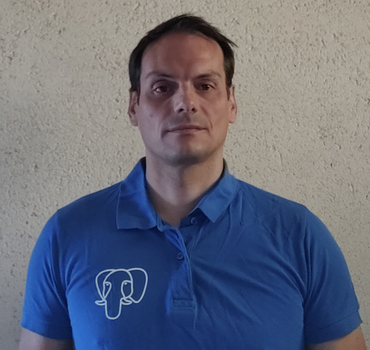

# Programme

## Mardi 11 juin 2024

A compléter

<!--

  
14h00
  

  

  
  

  

  <h3>Ouverture des portes</h3>
  

  
14h30

  

  
  

  

  <h3>Mot d'accueil</h3>
  

  
14h45

  

  
  

  

  <h3>PostgreSQL et Unicode, un tour des nouveautés</h3>
  
Par <a href="orateurs#daniel_verite" class="pg_speaker_name">Daniel Vérité</a> - Indépendant

  

  Cette présentation fera le point sur les évolutions relatives à la gestion d'Unicode et aux collations, notamment via l'usage de la bibliothèque ICU.
  Depuis PostgreSQL 10, la bibliothèque ICU a été ajoutée comme fournisseur de collation alternatif dans PostgreSQL.
  Dans cette présentation, on exposera notamment les fonctionnalités et les performances des collations ICU, et on verra comment paramétrer ses bases de données pour en profiter.
  On parlera aussi des pièges liés aux collations : pourquoi est-ce que les mises à jour du système peuvent poser un problème à certains index, et comment faire ces mises à jour en sécurité.
  

  

  <a href="/docs/2023/01_Daniel_Verite_PostgreSQL_et_Unicode_un_tour_des_nouveautes.pdf">
  <i class="fa fa-desktop" aria-hidden="true"></i>Support de la présentation
  </a>
  

  <!--
  

  <a href="#">
  <i class="fa fa-youtube-play" aria-hidden="true"></i>Vidéo
  </a>
  

  

-->

<!--

  
15h30

  

  
  

  

  <h3>Utiliser PostgreSQL dans un environnement Kubernetes avec Minikube</h3>
  
Par <a href="orateurs#emmanuel_rami" class="pg_speaker_name">Emmanuel Rami</a> - CapData

  

  La présentation décrira les étapes suivantes :
  - présentation de la containérisation via Kubernetes
  - les prérequis de la mise en place de la virtualisation
  - l'installation des packages nécessaires
  - configuration logiciel
  - utilisation dans un environnement client - serveur
  

  

  <a href="/docs/2023/02_Emmanuel_Rami_Utiliser_PostgreSQL_dans_un_environnement_Kubernetes_avec_Minikube.pptx">
  <i class="fa fa-desktop" aria-hidden="true"></i>Support de la présentation
  </a>
  

  <!--
  

  <a href="#">
  <i class="fa fa-youtube-play" aria-hidden="true"></i>Vidéo
  </a>
  

  

 -->

<!--

  
16h15

  

  
  

  

  <h3>Pause</h3>
  

  
16h45

  

  
  

  

  <h3>Table ronde du Groupe de Travail Inter-Entreprises</h3>
  Débats et Retours d'expérience autour de l'actualité du
  <a href='https://www.postgresql.fr/entreprises:accueil'>Groupe de Travail Inter-Entreprises</a>
  : Perspectives et Usages actuels de PostgreSQL, Cloud Public vs. Cloud Privé, Constitution
  d'un groupe au niveau européen, etc.
   
  Intervenants :
  <ul>
  <li>Anthony Nowocien ( Société Générale )</li>
  <li>Cédric Duprez ( IGN )</li>
  <li>Didier Brugat ( Total Énergies )</li>
  </ul>
   
  Animé par Jean-Paul Argudo.
  

  
17h45

  

  
  

  

  <h3>Mot de clôture</h3>
  

-->

## Grande soirée communautaire

<!--

  
19h30 - 23h00

  

  
  

  

  <h3>Grande soirée ouverte à tous et incluse dans le prix de votre billet.</h3>
  
A deux pas de la gare, tous les participants, sponsors et orateurs se retrouvent pour une grande soirée de rencontre et de partage autour d'un apéritif dînatoire.

  
Lieu de Rendez-vous : <strong>Le petit tigre</strong>, 5 rue du Faubourg national, 67000. Strasbourg.

  

-->

## Mercredi 12 juin 2024

<!--

  
09h00

  

  
  

  

  <h3>Ouverture des portes</h3>
  

  
09h30

  

  
  

  

  <h3>Mot d'accueil</h3>
  

  
09h45

  

  
  

  

  <h3>Tour d'horizon des Connection Poolers</h3>
  
Par <a href="orateurs#frederic_delacourt" class="pg_speaker_name">Frédéric Delacourt</a> - Data Bene

  

  Je vous propose de (re)voir ensemble la notion de Connection Pooler, les fonctionnalités traditionnelles ainsi que les évolutions offertes par les Connection Poolers de nouvelle génération.
  Dans un premier temps, je propose de montrer les étapes d'une connexion à PostgreSQL ce qui permet d'aborder le protocole de communication de PostgreSQL et de voir les impacts systèmes (mémoire, processus) associés.
  Le deuxième temps est consacré aux types de Connection Poolers (applicatif, proxy) et voir à quels "problèmes" ils répondent.
  Enfin, le troisième temps décrit l'évolution des Connection Poolers de pgbouncer vers les nextGens Connection Poolers.
  

  

  <a href="/docs/2023/03_Frederic_Delacourt_Tour_d_horizon_des_Connection_Poolers.pdf">
  <i class="fa fa-desktop" aria-hidden="true"></i>Support de la présentation</a>
  

  <!--
  

    <a href="#">
  <i class="fa fa-youtube-play" aria-hidden="true"></i>Vidéo
  </a>
  

  

  -->

<!--

  
10h30

  

  
  

  

  <h3>Pause</h3>
  

  
10h45

  

  
  

  

  <h3>Améliorons ensemble la documentation</h3>
  
Par <a href="orateurs#sarah_haim_lubczanski" class="pg_speaker_name">Sarah Haïm-Lubczanski</a> - Bedrock Streaming

  

  La documentation est le meilleur moyen de rassembler le savoir et de rendre les informations disponibles pour le plus grand nombre et de faire progresser tout le monde, des personnes débutantes aux plus avancées dans PostgreSQL. Prenons quelques pages de documentation de votre logiciel préféré, et examinons comment nous pourrions les améliorer. Avec quelques efforts sur le contenu et la présentation, votre documentation pourrait être plus lisible, et plus utile à la communauté. Quelques astuces pour produire directement une bonne documentation sont également au menu, tout comme l'art de relire une documentation existante.
  

  

  <a href="/docs/2023/04_Lets-make-it-better-now-together.pdf">
  <i class="fa fa-desktop" aria-hidden="true"></i>Support de la présentation</a>
  

  <!--
  

  <a href="#">
  <i class="fa fa-youtube-play" aria-hidden="true"></i>Vidéo
  </a>
  

  

  -->

<!--

  
11h30

  

  
  

  

  <h3>Les différentes fonctionnalités de sécurité dans Postgres</h3>
  
Par <a href="orateurs#sebastien_sire" class="pg_speaker_name">Sébastien Sire</a> - EDB

  

  La sécurité des données est une préoccupation croissante pour les organisations de toutes tailles. Dans ce contexte, Postgres a développé au fil des ans une solide réputation en matière de sécurité, offrant des fonctionnalités robustes pour protéger les données sensibles. Cette présentation examinera les différentes fonctionnalités de sécurité intégrées à Postgres telles que la gestion des utilisateurs, les gestion des accès, les ACL, le chiffrement de données, la journalisation et la vérification d'intégrité.
  

  <!--
  

  <a href="#">
  <i class="fa fa-desktop" aria-hidden="true"></i>Support de la présentation</a>
  

  

  <a href="#">
  <i class="fa fa-youtube-play" aria-hidden="true"></i>Vidéo
  </a>
  

  

  -->

<!--

  
12h15

  

  
  

  

  <h3>Repas</h3>
  

  
14h00

  

  
  
  
  

  

  <h3>Automatisation « IaaS » du déploiement et du MCO de PostgreSQL pour la MAIF avec Ansible</h3>
  
Par <a href="orateurs#yohann_martin" class="pg_speaker_name">Yohann MARTIN, Clément PAILLIER et Ludovic AUGEREAU</a> - MAIF

  

  Postgres en IAAS avec Ansible à la MAIF :
  - objectif de l'industrialisation,
  - architecture de déploiement,
  - description de l'industrialisation sous Ansible,
  - focus sur le projet Ansible.
  

  

  <a href="/docs/2023/06_Yohann_Martin_Automatisation_du_deploiement_IAAS.pdf">
  <i class="fa fa-desktop" aria-hidden="true"></i>Support de la présentation
  </a>
  

  <!--
  

  <a href="#">
  <i class="fa fa-youtube-play" aria-hidden="true"></i>Vidéo</a>
  

  

  -->

<!--

  
14h45

  

  
  

  

  <h3>De la feuille à l'éléphant</h3>
  
Par <a href="orateurs#matthieu_ornillon" class="pg_speaker_name">Matthieu Cornillon</a> - Aiven
  

  

  Un développeur m'a dit un jour "faire du SQL c'est juste ringard, Mongo, ça c'est sexy !". Mais notre cher Éléphant n'a pas dit son dernier mot !
  Après un bref KO technique, j'en suis venu à la conclusion que de nombreux choix de moteurs sont faits de cette façon ces jours-ci : par la voix des développeurs et de leur perception de la technologie. Et il se trouve que Postgres n'a pas toujours la cote.
  Cette conférence, à mi-chemin entre une comparaison fonctionnelle et un retour d'expérience, s'adresse à tous les développeurs, DBAs, architectes qui ont déjà eu à choisir entre Mongo et Postgres, et à tout ceux qui essayent de construire un argumentaire sur le moteur à choisir pour les bons cas d'usage.
  Let's make Postgres sexy again!
  

  

  <a href="/docs/2023/07_Matthieu_Cornillon_De_la-feuille_a_lelephant.pdf">
  <i class="fa fa-desktop" aria-hidden="true"></i>Support de la présentation
  </a>
  

  <!--
  

  <a href="#">
  <i class="fa fa-youtube-play" aria-hidden="true"></i>Vidéo
  </a>
  

  

  -->

<!--

  
15h15

  

  
  

  

  <h3>Pause</h3>
  

  
15h45

  

  
  

  

  <h3>Moteur de Recherche Plein Texte Sémantique en PostgreSQL</h3>
  
Par <a href="orateurs#pierre_alexandre_voye" class="pg_speaker_name">Pierre-Alexandre Voye</a> - Green Software Solutions

  

  PostgreSQL est doté d'un système de recherche plein texte assez performant et rapide. On montrera comment transformer ce système en moteur de recherche sémantique.
  Cette présentation est un retour d'expérience d'écriture d'un moteur de recherche de métiers avec des capacités sémantiques, utilisant le ROME v4 de Pôle-Emploi.
  L'utilisateur propose un mot clé, même mal orthographié, qui n'appartient pas forcément à la fiche métier ou ses données. Par exemple, "bois" doit aussi renvoyer des fiches métiers concernant l'ameublement.
  Après avoir présenté le système de recherche plein texte de PostgreSQL, avec ses subtilités (calcul de radicaux, query, ranking), nous expliquerons comment introduire de la sémantique grâce à des notions de champs lexicaux et d'ontologie de mots (Wordnet). Nous aborderons rapidement le sujet de l'orthographe des mots-clés.
  

  <!--
  

  <a href="#">
  <i class="fa fa-desktop" aria-hidden="true"></i>Support de la présentation
  </a>
  

  

  <a href="#">
  <i class="fa fa-youtube-play" aria-hidden="true"></i>Vidéo
  </a>
  

  

  -->

<!--

  
16h15

  

  
  

  

  <h3>Lightning Talk</h3>
  

    Une série de lightning talks de 5 minutes. Chaque participant au PG Day peut choisir le sujet de son choix (technique ou non) et le présenter en 5 minutes top chrono ! :)
    Envoyez vos propositions à <a href="mailto:contact@pgday.fr">contact@pgday.fr</a>
  

  

  -->

<!--

  
17h15

  

  
  

  

  <h3>Mot de clôture</h3>
  

  -->

<!--

  
17h30

  

  <h3>FIN</h3>
  

  -->
